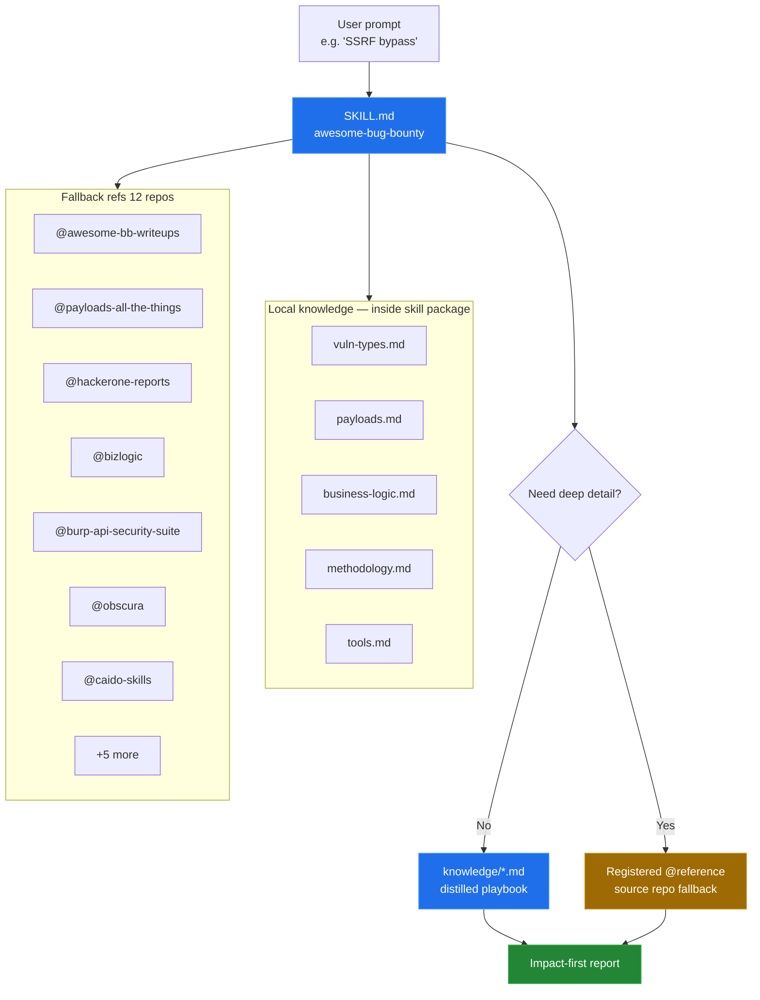

<div align="center">

# Awesome Bug Bounty

**Merged bug-bounty knowledge → an agent skill (OpenCode, Claude Code, Codex, Cursor, …), with source repos as live fallback references.**


<br/>

[](#-quick-start)
[](https://skills.sh/yangtech-gh/awesome-bug-bounty/awesome-bug-bounty)
[](#-vulnerability-coverage)
[](#knowledge-sources--fallback-references)
[](#-payload--bypass-cheat-sheet)
[](#-license)
[](#-authorized-testing-only)

<br/>

**[Quick Start](#-quick-start)** · **[Architecture](#-architecture)** · **[Router](#-skill-router)** · **[Knowledge](#-knowledge-base)** · **[Programs](#-programs--platforms)** · **[Reports](#-report-template)**

</div>

> [!CAUTION]
> **Authorized testing only.** Stay inside program scope and rules of engagement. Do not run payloads against systems you do not have permission to test.

---

## Table of contents

| # | Section | # | Section |
|:-:|---|:-:|---|
| 1 | [Quick Start](#-quick-start) | 8 | [Payload & bypass cheat sheet](#-payload--bypass-cheat-sheet) |
| 2 | [Architecture](#-architecture) | 9 | [Business logic & races](#-business-logic--race-conditions) |
| 3 | [Engage flow](#-engage-flow-impact-first) | 10 | [Methodology & recon](#-methodology-recon--reporting) |
| 4 | [Skill router](#-skill-router) | 11 | [Tooling](#-tooling) |
| 5 | [Knowledge base](#-knowledge-base) | 12 | [Programs & platforms](#-programs--platforms) |
| 6 | [Vulnerability coverage](#-vulnerability-coverage) | 13 | [Report template](#-report-template) |
| 7 | [Knowledge sources](#knowledge-sources--fallback-references) | 14 | [Interactive index](#-interactive-index-jump) |

---

## Quick start

### Option A — `npx skills` (recommended, multi-agent)

The repo layout (`skills/awesome-bug-bounty/SKILL.md` + bundled `knowledge/`) is discovered by the [skills CLI](https://github.com/vercel-labs/skills) and installs into OpenCode, Claude Code, Codex, Cursor, and [70+ agents](https://github.com/vercel-labs/skills#supported-agents). Also listed on [skills.sh](https://skills.sh/yangtech-gh/awesome-bug-bounty/awesome-bug-bounty).

```bash
# One-liner (pinned skill — share this)
npx skills@latest add YangTech-gh/Awesome-Bug-Bounty@awesome-bug-bounty

# Preview what's in the repo
npx skills@latest add YangTech-gh/Awesome-Bug-Bounty --list

# Interactive install (pick skills + agents)
npx skills@latest add YangTech-gh/Awesome-Bug-Bounty

# Non-interactive: global, OpenCode only
npx skills@latest add YangTech-gh/Awesome-Bug-Bounty \
  --skill awesome-bug-bounty -a opencode -g -y
```

Later: `npx skills update` · `npx skills list` · `npx skills remove awesome-bug-bounty`.

> [!NOTE]
> `npx skills` installs the skill package only. The optional `@reference` aliases (deep fallback into 12 source repos) still need the opencode `references` block below.

### Option B — Claude Code plugin

```bash
# In Claude Code
/plugin marketplace add YangTech-gh/Awesome-Bug-Bounty
/plugin install awesome-bug-bounty@awesome-bug-bounty
```

### Option C — manual opencode registration

<details open>
<summary><b>Install the skill in opencode</b> — click to collapse</summary>

<br/>

```bash
# 1. Clone
git clone https://github.com/YangTech-gh/Awesome-Bug-Bounty.git
cd Awesome-Bug-Bounty
```

Register in `~/.config/opencode/opencode.jsonc`:

```jsonc
{
  "$schema": "https://opencode.ai/config.json",
  "skills": {
    "paths": ["~/Awesome-Bug-Bounty/skills"]
  },
  "references": {
    "@awesome-bb-writeups": "https://github.com/devanshbatham/Awesome-Bugbounty-Writeups",
    "@bug-bounty-reference": "https://github.com/ngalongc/bug-bounty-reference",
    "@payloads-all-the-things": "https://github.com/swisskyrepo/PayloadsAllTheThings",
    "@hack-skills": "https://github.com/yaklang/hack-skills",
    "@bizlogic": "https://github.com/ekomsSavior/bizlogic",
    "@aw-junaid-bug-bounty": "https://github.com/aw-junaid/bug-bounty",
    "@hackerone-reports": "https://github.com/reddelexc/hackerone-reports",
    "@autorizepro": "https://github.com/WuliRuler/AutorizePro",
    "@burp-api-security-suite": "https://github.com/Teycir/BurpAPISecuritySuite",
    "@awesome-bugbounty-tools": "https://github.com/vavkamil/awesome-bugbounty-tools",
    "@obscura": "https://github.com/h4ckf0r0day/obscura",
    "@caido-skills": "https://github.com/caido/skills"
  }
}
```

```bash
# 2. Validate the skill package (paths, frontmatter, README links)
python3 scripts/validate_skill.py

# 3. Restart opencode (config is not hot-reloaded)
```

**Triggers:** bug bounty · writeups · payloads · IDOR · business logic · SSRF · recon · HackerOne · API security · auth bypass · race conditions · Burp alternatives · Caido · AI pentest agents · MCP security

</details>

<details>
<summary><b>Repo layout</b> — click to expand</summary>

<br/>

```
Awesome-Bug-Bounty/
├── README.md                                 ← this file (human docs)
├── scripts/
│   └── validate_skill.py                     ← package integrity check
└── skills/
    └── awesome-bug-bounty/                   ← self-contained skill package
        ├── SKILL.md                          ← source of truth (rules, gate, routers)
        └── knowledge/
            ├── vuln-types.md                 ← per-vuln hunt focus + patterns
            ├── payloads.md                   ← payload / WAF bypass cheat sheet
            ├── business-logic.md             ← 9 logic checks, payment matrix, races
            ├── methodology.md                ← recon pipeline, commands, reporting
            ├── tools.md                      ← tool matrix, proxies, AI hunters, MCP
            └── install.md                    ← copy-paste install cmds for every tool
```

The skill is **self-contained**: `knowledge/` lives inside the skill directory, so progressive disclosure works wherever the skill is installed. The `skills/<name>/SKILL.md` layout is what the [`skills` CLI](https://github.com/vercel-labs/skills) discovers — install with `npx skills add YangTech-gh/Awesome-Bug-Bounty` (Option A above), or register `skills/` via opencode `skills.paths` and symlink/copy into `~/.config/opencode/skills/`.

| File | Role |
|---|---|
| [`skills/awesome-bug-bounty/SKILL.md`](skills/awesome-bug-bounty/SKILL.md) | **Source of truth:** operating rules, profile gate, engage flow, category router, fallback table |
| [`knowledge/vuln-types.md`](skills/awesome-bug-bounty/knowledge/vuln-types.md) | Hunt focus for 30+ classes (XSS → smuggling → GraphQL) |
| [`knowledge/payloads.md`](skills/awesome-bug-bounty/knowledge/payloads.md) | Context matrix, injection payloads, 401/403 bypass list |
| [`knowledge/business-logic.md`](skills/awesome-bug-bounty/knowledge/business-logic.md) | bizlogic 9 checks, payment attacks, state machines, races |
| [`knowledge/methodology.md`](skills/awesome-bug-bounty/knowledge/methodology.md) | Recon stages, impact ranking, best practices, non-duplicated engagement path, wordlists, report template |
| [`knowledge/tools.md`](skills/awesome-bug-bounty/knowledge/tools.md) | Tool-choice matrix · Caido/ZAP · AI hunters · Obscura · MCP stack · Burp extensions |
| [`knowledge/install.md`](skills/awesome-bug-bounty/knowledge/install.md) | Install commands + post-install setup (API keys, proxy CA, MCP registration cookbook), health check |

</details>

---

## Architecture



**Operating rules** (authoritative copy in [`SKILL.md`](skills/awesome-bug-bounty/SKILL.md))

1. Prefer local distilled knowledge first (`knowledge/*.md` inside the skill).
2. Fall back to `@references` only for writeup links, full payload lists, tool internals.
3. Authorized testing only — program scope + ROE.
4. Evidence standard: clear impact · minimal repro · PoC req/res · severity · fix guidance.

---

## Engage flow (impact-first)

Authoritative flow: [`SKILL.md`](skills/awesome-bug-bounty/SKILL.md) → *Engage flow*.

| Step | Action | Done when |
|:---:|---|---|
| **1** | **Scope** | Domains, exclusions, rate limits confirmed |
| **2** | **Recon** | Subdomains · endpoints · APIs · stack · auth surfaces · OpenAPI/Swagger |
| **3** | **Route** | Highest impact path first (table below) |
| **4** | **Playbook** | Matching `knowledge/*.md` section read; escalate to fallback only if uncovered |
| **5** | **Report** | Template in [Report template](#-report-template) |

**Impact ranking**

```
RCE / SQLi (data dump)  >  Auth bypass / ATO  >  SSRF (cloud metadata)
  >  IDOR (PII/mass)  >  Stored XSS (admin)  >  Business logic (money)
  >  Race limits  >  CSRF / CORS / open redirect  >  Info disclosure  >  Low-impact XSS
```

---

## Skill router

**The authoritative category router lives in [`SKILL.md`](skills/awesome-bug-bounty/SKILL.md) → *Category router*** (kept lean so the agent loads less per session). Quick map:

| Surface group | Knowledge file |
|---|---|
| Most vuln classes (XSS, SQLi, SSRF, smuggling, takeover, …) + payloads/WAF bypass | [`vuln-types`](skills/awesome-bug-bounty/knowledge/vuln-types.md) · [`payloads`](skills/awesome-bug-bounty/knowledge/payloads.md) |
| IDOR/BOLA, API recon, GraphQL, mass assignment | [`vuln-types`](skills/awesome-bug-bounty/knowledge/vuln-types.md) · [`methodology`](skills/awesome-bug-bounty/knowledge/methodology.md) · [`tools`](skills/awesome-bug-bounty/knowledge/tools.md) |
| Auth bypass, 2FA/MFA, OAuth/JWT/SAML, ATO | [`vuln-types`](skills/awesome-bug-bounty/knowledge/vuln-types.md) |
| Business logic, race conditions / TOCTOU | [`business-logic`](skills/awesome-bug-bounty/knowledge/business-logic.md) |
| Recon, wordlists, engagement workspace, report template, SPA browsing | [`methodology`](skills/awesome-bug-bounty/knowledge/methodology.md) · [`tools`](skills/awesome-bug-bounty/knowledge/tools.md) |
| Proxy/scanner/AI-hunter/MCP tool choice, agent orchestration | [`tools`](skills/awesome-bug-bounty/knowledge/tools.md) |
| Install commands, API keys, proxy CA, MCP registration | [`install`](skills/awesome-bug-bounty/knowledge/install.md) |

---

## Knowledge base

Five local playbooks plus an install guide. Expand each for the full index.

<details>
<summary><b>vuln-types.md</b> — hunt focus & patterns (30+ classes)</summary>

<br/>

| Class | Hunt for | Escalation / notes |
|---|---|---|
| **XSS** | Reflection in HTML/JS/attrs; JSONP; postMessage; uploads; blind in admin fields | self-XSS→CSRF→stored; session theft→ATO; CSP gadget bypasses |
| **SQLi** | ORDER BY / search / sort / headers; second-order | union · boolean · time · error · OOB |
| **SSRF** | URL/webhook/avatar/PDF params | cloud metadata · port scan · Gopher/Redis RCE · rebinding |
| **IDOR / BOLA** | Sequential/GUID IDs; owner/tenant params | AutorizePro replay; ORM leaks (Django/Prisma/Ransack) |
| **Auth / ATO / 2FA** | Reset tokens, OTP, OAuth redirect_uri, JWT alg, SAML wrapping | claim tamper · state bypass · remember-device abuse |
| **Race condition** | Coupons, stock, votes, single-use codes | Turbo Intruder last-byte sync · HTTP/2 single-packet |
| **Business logic** | Pricing, limits, workflow | → [business-logic.md](#-business-logic--race-conditions) |
| **CSRF** | State-changes without token; JSON content-type trust | → stored XSS; 2FA disable |
| **CORS** | Reflecting origin + credentials | cross-origin read of auth responses |
| **RCE / deser / SSTI** | Uploads, gadgets, template engines | ysoserial · pickle · Jinja2/Twig chains |
| **CMDi** | Spaceless `$IFS`, wildcards, ImageMagick/FFmpeg | disable_functions bypasses |
| **Upload / LFI** | Double ext, polyglot, phar; wrappers `php://filter` | log poison · pearcmd · `/proc/self/environ` |
| **Open redirect** | `//evil`, `@`, backslash | → OAuth token theft |
| **Clickjacking** | Missing XFO / weak frame-ancestors | pair with CSRF |
| **Subdomain takeover** | Dangling CNAME (GitHub/S3/Heroku…) | can-i-take-over-xyz |
| **Cache** | Deception (path) · poisoning (unkeyed headers) | X-Forwarded-Host · X-Original-URL |
| **Smuggling** | CL.TE / TE.CL / TE.TE · H2 downgrade | cache poison → XSS / session |
| **Host header** | Absolute-URL, password reset, routing | reset poisoning · SSRF |
| **GraphQL** | Introspection, batching, nested DoS, node IDOR | Field suggestions leak schema |
| **API Top 10** | BOLA, BFLA, mass assignment, excess data | → [methodology](#-methodology-recon--reporting) |
| **Prototype pollution** | Merge/clone sinks, gadget chains | → RCE in JS runtimes |
| **WebSocket hijack** | Missing origin check on WS upgrade | session riding |
| **401/403 bypass** | Path tricks · override headers · method matrix | see [payloads](#-payload--bypass-cheat-sheet) |
| **SAML/SSO abuse** | Signature wrapping · NameID comment · XXE | ATO via assertion forge |
| **Supply chain** | Dependency confusion · typosquat · lockfile | registry boundary tests |
| **Email / CRLF / header** | SMTP injection · log forge · response split | host header → link forge |

**Full narrative + fallback paths:** [`knowledge/vuln-types.md`](skills/awesome-bug-bounty/knowledge/vuln-types.md)

</details>

<details>
<summary><b>payloads.md</b> — context matrix & cheat sheet</summary>

<br/>

**Context selection matrix**

| Context | Approach |
|---|---|
| HTML body | `<script>`, `onerror` / `onload`, `` |
| Attribute | close quote `"><svg onload=…>` |
| JS string | `' -alert(1)- '` · `` `${alert(1)}` `` |
| URL param | URL-encode / double-encode · `javascript:` |
| JSON | valid JSON + escape: `{"x":"\";alert(1)//"}` |
| Template engine | detect first: `{{7*7}}` vs `${7*7}` vs `<%= 7*7 %>` |

**Quick payloads by class**

<details>
<summary>XSS · SQLi · NoSQLi</summary>

- XSS: `<script>alert(1)</script>` · `` · `<svg/onload=alert(1)>` · `<details open ontoggle=…>` · blind via webhook in User-Agent/comments
- SQLi: `ORDER BY n` → `' UNION SELECT NULL-- -` · boolean `' AND 1=1-- -` · time `SLEEP(5)` / `WAITFOR DELAY` / `pg_sleep` · WAF: `/*!50000UNION*/`, `%09`, HPP
- NoSQL: `{"username":{"$gt":""},"password":{"$gt":""}}` · `$where` JS · duplicate-key override

</details>

<details>
<summary>SSRF · CMDi · SSTI · LFI</summary>

- SSRF targets: `169.254.169.254` + AWS/GCP/Azure metadata paths · bypass: decimal `2130706433`, `127.1`, rebinding, `gopher://`/`dict://`/`file://`
- CMDi: `;` `|` `||` `&&` `%0a` · spaceless `$IFS` · `{cat,/etc/passwd}` · time `sleep 5`
- SSTI Jinja2: `{{config.__class__.__init__.__globals__['os'].popen('id').read()}}`
- LFI: `php://filter/convert.base64-encode/resource=index.php` · `phar://` · `zip://` · log poison

</details>

<details>
<summary>JWT · OAuth · Open redirect · 401/403</summary>

- JWT: `alg:none` · RS256→HS256 (HMAC with public key) · claim tamper · `kid` traversal
- OAuth: `redirect_uri` tricks — path traversal, `app.com.evil.com`, open-redirect on allowlist
- Open redirect: `//evil.com` · `/\evil.com` · `///evil.com` · `good.com@evil.com`
- 401/403: `/%61dmin` · `/admin.json` · `//admin` · `X-Original-URL` · `X-Forwarded-For: 127.0.0.1` · method override

</details>

**Race snippet (Turbo Intruder):** see [`knowledge/payloads.md`](skills/awesome-bug-bounty/knowledge/payloads.md)

**Full lists:** fetch `@payloads-all-the-things` → category `README.md`

</details>

<details>
<summary><b>business-logic.md</b> — 9 checks, payment matrix, state machines</summary>

<br/>

**Nine heuristic checks (bizlogic)**

| # | Check | Failure mode |
|:-:|---|---|
| 1 | Unverified ownership claims/transfers | email/domain change without proof |
| 2 | Auth bypass via alternate channels | API path weaker than UI |
| 3 | Authz via user-controlled keys | `role`/`tenant` in body |
| 4 | Weak password recovery | predictable/expiring tokens |
| 5 | Incorrect ownership assignment | attacker-controlled `user_id` on create |
| 6 | Resource allocation without limits | unlimited coupons/seats/credits |
| 7 | Premature resource release | commit before validation |
| 8 | Single unique action flaws | one-vote/coupon only client-side |
| 9 | Client-side workflow enforcement | skip hidden wizard step → `POST /complete` |

**Payment manipulation matrix (abbrev.)**

| Attack | Test |
|---|---|
| Negative qty/price | `quantity=-1` → credit? |
| Discount stacking | two coupons; % + fixed |
| Currency confusion | pay weak / refund strong |
| Client totals trusted | tamper `total`/`amount` |
| Refund abuse | double refund; refund w/o return |
| Promo reapply | reset usage count |

**State machine:** map `draft → review → approved → paid → shipped` · replay out-of-order / reverse transitions · concurrent transitions for invariant breaks.

**Race playbook:** last-byte sync · HTTP/2 single-packet · verify **server invariants** (balance, stock, tally) — not just HTTP 200.

</details>

<details>
<summary><b>methodology.md</b> — recon pipeline & commands</summary>

<br/>

1. **Asset discovery** — subfinder · assetfinder · amass · crt.sh · httpx · dnsx · takeover check  
2. **Content discovery** — katana · hakrawler · ffuf/gobuster · kiterunner · ApiHunter · LinkFinder  
3. **Secrets** — trufflehog · gitleaks · `.git`/`.env`/backups · dependency confusion  
4. **Fingerprint** — tech detect · framework defaults (Flask debug, actuators, Jenkins)  
5. **Auth surface** — SSO/SAML/OIDC · reset flows · 2FA · JS-extracted API keys  

**One-liners**

```bash
ffuf -u https://t/FUZZ -w seclists/Discovery/Web-Content/common.txt -mc 200,301,403,500
cat subs.txt | httpx -sc -title -tech-detect
nuclei -u https://t -severity critical,high -rl 100
sqlmap -u 'https://t/?id=1' --batch --level 3 --risk 2
dalfox url 'https://t/?q=x' --pipe
```

**Wordlists** (in aw-junaid/bug-bounty): `custom-subdomains.txt` · `directories-small.txt` · `xss-payloads.txt`

</details>

<details>
<summary><b>tools.md</b> — tool-choice matrix · Burp alternatives · AI hunters · Obscura · MCP</summary>

<br/>

**Tool-choice matrix (headline)**

| Need | Pick |
|---|---|
| Manual proxy/replay default | **Caido** (free multi-project, HTTPQL, AI SDK/skill) or Burp Community |
| Active scan + OAST | Burp Pro / **ZAP** + nuclei (Caido lacks Collaborator) |
| Known-CVE sweep | nuclei + custom templates |
| SPA rendering / agent browsing | **Obscura** (Rust CDP+MCP headless browser, stealth) |
| Agent-run recon from chat | MCP: HexStrike · pd-tools-mcp · mcp-bb (scope-enforced) · BugHound · MoonMCP |
| Autonomous hunt w/ proof | Evidence-first: **AI Scanner** (deterministic oracles) · **VERDICT** · **ptai** (proof capsules) · Xalgorix (independent verifier) · AOBTD · SIPHON |
| Scripted interception | mitmproxy |

**Rule:** proxy for depth → nuclei for breadth → AI hunters for orchestration → **human-verify before reporting** (oracle/replay-verified findings only).

**Burp alternatives:** Caido (AI-native: official Client SDK + `caido/skills`, Shift plugin — Burp is not AI-native), ZAP (free full DAST + YAML automation), mitmproxy (programmatic). Burp still wins on BApp ecosystem, Scanner, Collaborator.

**Obscura fit:** SPA crawl, `browser_evaluate` DOM-XSS confirmation, MCP-driven authenticated flows, stealth recon — pairs with a proxy, never a scanner replacement.

**New surface:** MCP/LLM app testing — MCPScan, mcpsec, mcpwn, Burp MCP-server-scanner extension, AI Scanner prompt-injection canaries (OWASP LLM/MCP Top 10).

**Legacy core:** AutorizePro (authz replay + AI triage) · BurpAPISecuritySuite (15 API attack types) · bizlogic (9 heuristics) · complementary ProjectDiscovery stack.

**Install everything:** [`knowledge/install.md`](skills/awesome-bug-bounty/knowledge/install.md) — copy-paste `go install` / `pipx` / Docker / release-binary commands for the full stack, plus §9 one-shot core block, §10 health check, **§11 API-key/setup table**, **§12 MCP registration cookbook**, §13 done-when checklist.

**Operating profile gate** (authoritative: [`SKILL.md`](skills/awesome-bug-bounty/SKILL.md)): first use with no user rules → **one** `question` — `Defaults — Stealth` (recommended, applied immediately) or `Configure…` (mode · LLM backend · tool layers · install policy · MCP surface) → persisted to `engagements/<target>/profile.yaml`; everything after obeys it.

**No duplicate work:** [`knowledge/methodology.md`](skills/awesome-bug-bounty/knowledge/methodology.md) → *Non-duplicated engagement path* — one `scope.yaml` per program → one asset inventory → one URL/API corpus → tools fan out over shared files → findings deduped by `METHOD+host+path+param+class` → one report per issue. Plus 11 best practices (scope-first, rate limits, evidence-first, MCP surface minimization).

</details>

---

## Vulnerability coverage

42 classes indexed in the skill (detail in [`knowledge/vuln-types.md`](skills/awesome-bug-bounty/knowledge/vuln-types.md)):

<details open>
<summary>Expand the full tag list</summary>

<br/>

`XSS (R/S/DOM/blind/XSSI)` · `SQLi` · `NoSQLi` · `SSRF` · `XXE` · `IDOR/BOLA` · `CSRF` · `CORS` · `Auth bypass/ATO` · `2FA/MFA bypass` · `OAuth` · `JWT` · `SAML` · `Race condition` · `Business logic` · `RCE` · `Deserialization` · `SSTI` · `Command injection` · `File upload` · `LFI/RFI` · `Path traversal` · `Open redirect` · `Clickjacking` · `Subdomain takeover` · `Web cache deception` · `Web cache poisoning` · `HTTP request smuggling` · `CRLF/header injection` · `Host header attacks` · `Prototype pollution` · `GraphQL abuse` · `Mass assignment` · `API key leaks` · `Info disclosure/secrets` · `DoS` · `Email/header injection` · `Supply chain/dependency confusion` · `WebSocket hijacking` · `401/403 bypass` · `SAML/SSO abuse` · `Prompt injection / LLM app flaws` · `MCP server abuse`

</details>

---

## Knowledge sources & fallback references

Twelve upstream repos: merged into local knowledge, with a live fallback when you need links, full catalogs, or tool source. (One table — the alias list in [`SKILL.md`](skills/awesome-bug-bounty/SKILL.md) mirrors it for the agent.)

| # | Repository | Merged into local knowledge | Fallback when you need… | Alias · example deep path |
|:-:|---|---|---|---|
| 1 | [Awesome-Bugbounty-Writeups](https://github.com/devanshbatham/Awesome-Bugbounty-Writeups) | vuln index by bug type | full writeup link lists | `@awesome-bb-writeups` · XSS / IDOR / SSRF sections |
| 2 | [bug-bounty-reference](https://github.com/ngalongc/bug-bounty-reference) | writeups by nature (OAuth, money, XSSI) | historical categorized writeups | `@bug-bounty-reference` · `#IDOR` · `#Authentication-Bypass` |
| 3 | [PayloadsAllTheThings](https://github.com/swisskyrepo/PayloadsAllTheThings) | payload/bypass cheat sheet | complete category READMEs (64+) | `@payloads-all-the-things` · `SQL Injection/README.md` |
| 4 | [hack-skills · business-logic](https://github.com/yaklang/hack-skills/tree/main/skills/business-logic-vulnerabilities) | payment matrix, state machines, races | deep skill playbooks (auth, recon, api-sec…) | `@hack-skills` · `skills/business-logic-vulnerabilities/` |
| 5 | [bizlogic](https://github.com/ekomsSavior/bizlogic) | 9 heuristic checks + safe exploit flow | scanner source / check defs | `@bizlogic` · `bizlogic_scanner.py` |
| 6 | [aw-junaid/bug-bounty](https://github.com/aw-junaid/bug-bounty) | recon pipeline, cheatsheets, templates | wordlists + tool automation scripts | `@aw-junaid-bug-bounty` · methodologies · wordlists |
| 7 | [hackerone-reports](https://github.com/reddelexc/hackerone-reports) | top-report index pointers | by bug type + by program | `@hackerone-reports` · `docs/tops_by_bug_type/TOPSSRF.md` |
| 8 | [AutorizePro](https://github.com/WuliRuler/AutorizePro) | authz test workflow + AI triage notes | extension config/source details | `@autorizepro` · `AutorizePro.py` |
| 9 | [BurpAPISecuritySuite](https://github.com/Teycir/BurpAPISecuritySuite) | API suite workflow (15 attack types) | tabs, exports, integration flags | `@burp-api-security-suite` · tabs · export formats |
| 10 | [awesome-bugbounty-tools](https://github.com/vavkamil/awesome-bugbounty-tools) | tool routing by phase (incl. AI Agents index) | full curated list per category | `@awesome-bugbounty-tools` · `#ai-agents` |
| 11 | [obscura](https://github.com/h4ckf0r0day/obscura) | agent-browser fit notes (CDP/MCP/stealth) | CLI reference, MCP tools, wiki architecture | `@obscura` · `docs/Use-the-MCP-server.md` |
| 12 | [caido/skills](https://github.com/caido/skills) | AI-native proxy workflow notes | SDK API surface, skill tool definitions | `@caido-skills` · SDK tool definitions |

> Rule of thumb: **distilled local knowledge first → fetch `@reference` only when you need links, full payload catalogs, or tool source.**

---

## Programs & platforms

<details open>
<summary><b>Platforms</b> — click to collapse</summary>

<br/>

| Platform | Focus / notes |
|---|---|
| [HackerOne](https://www.hackerone.com) | Largest marketplace; archive → [hackerone-reports](https://github.com/reddelexc/hackerone-reports) `docs/tops_*` |
| [Bugcrowd](https://www.bugcrowd.com) | Crowdsourced + managed triage, private programs |
| [Intigriti](https://www.intigriti.com) | EU-heavy · beginner-friendly · monthly XSS challenges |
| [YesWeHack](https://www.yeswehack.com) | EU VDP / bug bounty · managed triage · Dojo training |
| [Immunefi](https://immunefi.com) | Web3 / smart contracts · highest critical payouts (up to $10M+) |
| [Synack](https://www.synack.com) | Invite-only vetted Red Team · FedRAMP/gov · high payouts |
| [HackenProof](https://hackenproof.com) | Mixed Web2 + Web3 crypto programs |
| [Open Bug Bounty](https://www.openbugbounty.org) | Public disclosure, no guaranteed payout — portfolio building |
| [Google VRP](https://bughunters.google.com) | Android · Google · Abuse · high payouts |
| [Microsoft MSRC](https://www.microsoft.com/msrc) | Azure / Windows / Office |
| [Apple Security](https://security.apple.com) | iOS / macOS / services |
| [Internet Bug Bounty](https://www.internetbugbounty.org) | Critical OSS (curl, Python, OpenSSL…) |

</details>

<details>
<summary><b>Programs in top-report datasets</b> — full list</summary>

<br/>

Shopify · GitLab · HackerOne · Uber · Twitter/X/xAI · Node.js · U.S. DoD · Slack · Coinbase · Verizon Media · Automattic · ownCloud · Nextcloud · Vimeo · Rockstar · TikTok · Brave · Yahoo · Starbucks · WordPress · curl · Rocket.Chat · Acronis · …
Program-specific indexes: [hackerone-reports `docs/tops_by_program/`](https://github.com/reddelexc/hackerone-reports/tree/master/docs/tops_by_program)

</details>

<details>
<summary><b>Program-selection tips</b></summary>

<br/>

1. Prefer **signal-rich, payout-clear** programs with documented scopes (public → VDP → paid ladder).
2. Study **program-specific top reports** before hunting — patterns repeat per codebase.
3. Track **acquisition / subdomain sprawl** for takeover and legacy-endpoint hunting.
4. Match effort to **asset age**: M&A leftovers and forgotten microsites outperform hardened cores.

</details>

---

## Report template

<details open>
<summary>Expand — copy-ready Markdown</summary>

<br/>

```markdown
# Title: [Vuln type] in [endpoint/feature] leading to [impact]

## Summary
One paragraph: what, where, impact.

## Severity
[CVSS or program rubric] — justification.

## Affected endpoint(s)
- METHOD https://host/path (param names)

## Steps to reproduce
1. ...
2. ...

## Proof of concept
Request/response (redact secrets). Screenshots if UI.

## Impact
Who/what is affected; data or action demonstrated (minimal).

## Remediation
Server-side check, authz fix, rate limit, etc.

## References
OWASP / CWE / writeup links.
```

**Evidence standard:** clear impact · minimal repro steps · PoC request-response · severity justification · fix guidance.

</details>

---

## Interactive index (jump)

| | | | |
|---|---|---|---|
| [Quick start](#-quick-start) | [Architecture](#-architecture) | [Engage flow](#-engage-flow-impact-first) | [Skill router](#-skill-router) |
| [Knowledge base](#-knowledge-base) | [Coverage](#-vulnerability-coverage) | [Sources](#knowledge-sources--fallback-references) | [Payloads](#-payload--bypass-cheat-sheet) |
| [Business logic](#-business-logic--race-conditions) | [Methodology](#-methodology-recon--reporting) | [Tooling](#-tooling) | [Programs](#-programs--platforms) |
| [Report template](#-report-template) | [Quick start](#-quick-start) | [License](#-license) | [Back to top](#awesome-bug-bounty) |

---

## License

**MIT** for this repo's skill + distilled docs.

Source repos retain their own upstream licenses. Knowledge is condensed for **educational and authorized security testing** only.

<div align="center">

<br/>

**[⬆ Back to top](#awesome-bug-bounty)**


</div>
